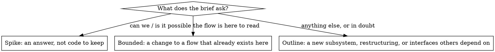

# Skills Implementation Plan

> **For agentic workers:** REQUIRED SUB-SKILL: Use superpowers:subagent-driven-development (recommended) or superpowers:executing-plans to implement this plan task-by-task. Steps use checkbox (`- [ ]`) syntax for tracking.

**Goal:** Every character wakes up with a system prompt that never changes for the life of its context, receives its situation and the skill for the current phase in messages, and can reach superpowers' discipline skills as a Claude Code plugin; a test runner records what the skills change on a real model.

**Architecture:** A new `harness/skills.py` locates the plugin tree (`harness/skills/`, overridable with `HARNESS_SKILLS_DIR`) and reads skill bodies. `ContextStore` gains a `system_prompt` hook beside `placement`; `StoryStore` fills it with the stable character prompt (identity, `being-a-character`, the CLI contract, the role) and stops storing prompts in context metadata. Every delivery opens with a situation line; the phase skill is appended whenever the story's phase differs from `Character.phase_seen`. `tests/skills/` runs scenarios against real `claude -p` behind `HARNESS_PAID_TESTS=1` and commits the recorded `verbs_log` as evidence.

**Tech Stack:** Python ≥3.10, PySide6 6.11, pytest, `tests/fake_claude.py`; the `claude` CLI for the paid layer; superpowers 6.3.0 at `~/.claude/plugins/cache/claude-plugins-official/superpowers/6.3.0/` as the vendoring source.

**Spec:** `docs/specs/story-lifecycle.md` §1 (`Character.phase_seen`), §2.2 (`proceed`), §3.1 (brief), §3.4 (recast), §5 (all of it). The proposal `docs/superpowers/proposals/2026-09-03-skills.md` explains why; §7 there lists the stress cases that became tests. Read spec §5 before every task; it is one page.

## Global Constraints

- **No backward compatibility** (DESIGN.md §0): no migration of `characters.json` or context `index.json`; new keys read with `.get()` defaults; the stored `systemPrompt` of existing character contexts is simply ignored.
- **Nobody sets status.** Phases and turns change only through `lifecycle.step`. `phase_seen` is bookkeeping about what a character was told, never a phase.
- The system prompt of a character context is **never stored**: `ContextStore.create` is called with no `system_prompt` for characters, and `Context._spawn` composes it through the hook at every spawn. Bare contexts and asides keep their stored prompts.
- The phase skill is **never in the system prompt**. It rides messages only (spec §5.3).
- Every spawn passes `--plugin-dir <skills dir>`. Bare contexts and asides too.
- Vendored files differ from upstream only by the rules in spec §5.1; every edit is listed in `harness/skills/VENDORED.md`. Nothing else in a vendored file changes.
- Skill frontmatter: `name` matches its directory, lowercase letters, digits and hyphens, ≤64 chars; `description` ≤1024 chars, third person, triggers only, never a workflow summary. `being-a-character` body < 150 words.
- Tests run with `QT_QPA_PLATFORM=offscreen ~/.venvs/mh-conda/bin/python -m pytest -q`. The suite is green at the end of every task (545 tests at the start). Paid tests never run without `HARNESS_PAID_TESTS=1`.
- Commit after every task, message style `Component: what changed`, trailer `Co-Authored-By: Claude Fable 5.1 <noreply@anthropic.com>`.
- **Out of scope:** `writing-skills`, a separate `yielding` skill, context-usage tracking and auto-recast, shrinking the situation line (proposal §6).

## File map

| File | Change |
|---|---|
| `harness/skills.py` | **New.** `skills_dir`, `plugin_args`, `skill_body`, `phase_skill`, `PHASE_SKILLS`. |
| `harness/skills/.claude-plugin/plugin.json`, `harness/skills/VENDORED.md`, `harness/skills/skills/*/` | **New.** The plugin: four zharn skills, five vendored. |
| `LICENSES/superpowers` | **New.** superpowers' MIT license. |
| `harness/config_def.py` | `SKILLS_DIR`; `CHARACTER_SYSTEM_PROMPT` rewritten as the stable prompt with `{meta_skill}` and `{role}`. |
| `harness/contexts.py` | `ContextStore.system_prompt` hook; `Context._system_prompt` uses it; `_spawn` adds `plugin_args()`. |
| `harness/stories.py` | `system_prompt` / `_character_prompt`; `situation`, `environment_line` reshaped; `_format` without `phase_before`; `_push`, `_phase_skill_due`; `phase_seen` in `_cast`, `_recast_now`, `cast_proceed`; `render_brief` without the Instructions section, with `skill`. |
| `harness/cli.py` | `story proceed` prints the returned skill body. |
| `tests/fake_claude.py` | `system_prompt` in the init event. |
| `tests/test_skills.py` | **New.** The module, the plugin tree's hygiene. |
| `tests/test_stories.py`, `tests/test_contexts_unit.py`, `tests/test_agents.py`, `tests/test_environments.py`, `tests/test_cli.py` | Per task. |
| `tests/skills/runner.py`, `tests/skills/test_scenarios.py`, `tests/skills/<scenario>/{prompt.md,fixture.py,expected.json,baseline.json,skilled.json}` | **New.** The paid layer. |
| `docs/DESIGN.md` §8 item 4, `README.md` | Status; the skills paragraph. |

---

### Task 1: `harness/skills.py` and the plugin skeleton

**Files:**
- Create: `harness/skills.py`
- Create: `harness/skills/.claude-plugin/plugin.json`
- Modify: `harness/config_def.py` (after `EFFORT_FLAGS`)
- Test: `tests/test_skills.py`

**Interfaces:**
- Produces: `skills.skills_dir() -> Path`; `skills.plugin_args() -> list[str]` (`["--plugin-dir", "<dir>"]`); `skills.skill_body(name: str) -> str` (markdown body of `skills/<name>/SKILL.md`, frontmatter stripped, `""` when missing); `skills.phase_skill(phase: str) -> str` (`""` for phases without a skill); `skills.PHASE_SKILLS = {"planning": "planning-a-story", "implementing": "implementing-a-story"}`; `cfg.SKILLS_DIR`.

- [ ] **Step 1: Write the failing tests**

```python
# tests/test_skills.py
"""harness/skills.py: locating the plugin tree and reading skill bodies; the plugin tree's hygiene (Task 2)."""
import json
import re
from pathlib import Path

import pytest

from harness import skills
from harness.__main__ import ROOT


def write_skill(root: Path, name: str, body: str, description: str = "Use when testing"):
    d = root / "skills" / name
    d.mkdir(parents=True)
    (d / "SKILL.md").write_text(f"---\nname: {name}\ndescription: {description}\n---\n\n{body}\n", encoding="utf-8")


def test_default_dir_is_the_checkout_plugin(monkeypatch):
    monkeypatch.delenv("HARNESS_SKILLS_DIR", raising=False)
    assert skills.skills_dir() == ROOT / "harness" / "skills"
    assert skills.plugin_args() == ["--plugin-dir", str(ROOT / "harness" / "skills")]


def test_env_overrides_the_dir(tmp_path, monkeypatch):
    monkeypatch.setenv("HARNESS_SKILLS_DIR", str(tmp_path))
    assert skills.skills_dir() == tmp_path and skills.plugin_args() == ["--plugin-dir", str(tmp_path)]


def test_skill_body_strips_frontmatter_and_whitespace(tmp_path, monkeypatch):
    monkeypatch.setenv("HARNESS_SKILLS_DIR", str(tmp_path))
    write_skill(tmp_path, "planning-a-story", "# Plan\n\nRead first.\n\n")
    assert skills.skill_body("planning-a-story") == "# Plan\n\nRead first."


def test_skill_body_is_empty_for_a_missing_or_blank_skill(tmp_path, monkeypatch):
    monkeypatch.setenv("HARNESS_SKILLS_DIR", str(tmp_path))
    assert skills.skill_body("nope") == ""
    write_skill(tmp_path, "blank", "")
    assert skills.skill_body("blank") == ""


def test_phase_skill_maps_phases_to_skills(tmp_path, monkeypatch):
    monkeypatch.setenv("HARNESS_SKILLS_DIR", str(tmp_path))
    write_skill(tmp_path, "planning-a-story", "PLAN")
    write_skill(tmp_path, "implementing-a-story", "BUILD")
    assert skills.phase_skill("planning") == "PLAN" and skills.phase_skill("implementing") == "BUILD"
    assert skills.phase_skill("done") == "" and skills.phase_skill("todo") == "" and skills.phase_skill("") == ""


def test_plugin_manifest_names_the_plugin_zharn():
    manifest = json.loads((ROOT / "harness" / "skills" / ".claude-plugin" / "plugin.json").read_text())
    assert manifest["name"] == "zharn"
```

- [ ] **Step 2: Run the tests to verify they fail**

Run: `QT_QPA_PLATFORM=offscreen ~/.venvs/mh-conda/bin/python -m pytest tests/test_skills.py -q`
Expected: FAIL with `ModuleNotFoundError: No module named 'harness.skills'`

- [ ] **Step 3: Write the module, the manifest, and the config knob**

```python
# harness/skills.py
"""Skills: the files a character wakes up with (docs/specs/story-lifecycle.md §5). `harness/skills/` is one
Claude Code plugin — `--plugin-dir` at every spawn — and the harness reads the meta and phase skills out of
the same tree to inject them itself. HARNESS_SKILLS_DIR overrides the tree; the paid test runner points it
at a copy with one skill blanked."""
from __future__ import annotations

import os
from pathlib import Path

from harness import config as cfg

DEFAULT_DIR = Path(__file__).resolve().parent / "skills"
PHASE_SKILLS = {"planning": "planning-a-story", "implementing": "implementing-a-story"}


def skills_dir() -> Path:
    return Path(os.environ.get("HARNESS_SKILLS_DIR") or getattr(cfg, "SKILLS_DIR", "") or DEFAULT_DIR)


def plugin_args() -> list[str]:
    return ["--plugin-dir", str(skills_dir())]


def skill_body(name: str) -> str:
    """The markdown body of skills/<name>/SKILL.md, frontmatter stripped; "" when the file is missing or blank."""
    try:
        text = (skills_dir() / "skills" / name / "SKILL.md").read_text(encoding="utf-8")
    except OSError:
        return ""
    if text.startswith("---"):
        end = text.find("\n---", 3)
        if end != -1:
            text = text[end + 4:]
    return text.strip()


def phase_skill(phase: str) -> str:
    name = PHASE_SKILLS.get(phase)
    return skill_body(name) if name else ""
```

```json
// harness/skills/.claude-plugin/plugin.json
{
  "name": "zharn",
  "description": "What a zharn character wakes up with: the meta and phase skills, and discipline skills vendored from superpowers",
  "version": "0.0.1",
  "license": "GPL-3.0-or-later"
}
```

In `harness/config_def.py`, after the `EFFORT_FLAGS` line:

```python
# The skills plugin (lifecycle spec §5): passed as --plugin-dir at every spawn and read for the meta and phase
# skills. Empty = harness/skills/ in this checkout. HARNESS_SKILLS_DIR overrides at runtime.
SKILLS_DIR = ""
```

- [ ] **Step 4: Run the tests to verify they pass**

Run: `QT_QPA_PLATFORM=offscreen ~/.venvs/mh-conda/bin/python -m pytest tests/test_skills.py -q`
Expected: 6 passed

- [ ] **Step 5: Commit**

```bash
git add harness/skills.py harness/skills/.claude-plugin/plugin.json harness/config_def.py tests/test_skills.py
git commit -m "Skills: harness/skills.py locates the plugin tree and reads skill bodies; the zharn plugin manifest" -m "Co-Authored-By: Claude Fable 5.1 <noreply@anthropic.com>"
```

---

### Task 2: The skills tree — four zharn skills, five vendored, VENDORED.md, the license

**Files:**
- Create: `harness/skills/skills/being-a-character/SKILL.md`, `planning-a-story/SKILL.md`, `implementing-a-story/SKILL.md`, `delegating/SKILL.md`
- Create (vendored): `harness/skills/skills/test-driven-development/`, `systematic-debugging/`, `verification-before-completion/`, `receiving-code-review/`, `requesting-code-review/`
- Create: `harness/skills/VENDORED.md`, `LICENSES/superpowers`
- Test: `tests/test_skills.py` (append)

**Interfaces:**
- Consumes: `skills.skill_body` from Task 1.
- Produces: the nine skill directories every later task reads; `skill_body("being-a-character")` non-empty and under 150 words; `phase_skill("planning")` and `phase_skill("implementing")` non-empty.

The four zharn skills are written here so the delivery tasks have real bodies to inject. Their RED phase is Task 6: the baseline runs there are the evidence spec §5.4 asks for, and Task 6 folds the rationalizations it observes back into these tables.

- [ ] **Step 1: Write the failing hygiene tests**

Append to `tests/test_skills.py`:

```python
# ---------------------------------------------------------------- the plugin tree (spec §5.1)

PLUGIN = ROOT / "harness" / "skills"
ZHARN = {"being-a-character", "planning-a-story", "implementing-a-story", "delegating"}
VENDORED = {"test-driven-development", "systematic-debugging", "verification-before-completion",
            "receiving-code-review", "requesting-code-review"}
FORBIDDEN = ("superpowers:", "human partner", "subagent", "Subagent", "Task tool", "TodoWrite")


def frontmatter(path: Path) -> dict:
    text = path.read_text(encoding="utf-8")
    assert text.startswith("---\n"), path
    head = text[4:text.index("\n---", 4)]
    return dict(line.split(":", 1) for line in head.splitlines() if ":" in line)


def test_the_tree_holds_exactly_the_spec_skills():
    assert {p.name for p in (PLUGIN / "skills").iterdir() if p.is_dir()} == ZHARN | VENDORED


@pytest.mark.parametrize("name", sorted(ZHARN | VENDORED))
def test_frontmatter_is_valid_and_matches_the_directory(name):
    fm = frontmatter(PLUGIN / "skills" / name / "SKILL.md")
    assert fm["name"].strip() == name and re.fullmatch(r"[a-z0-9]+(-[a-z0-9]+)*", name) and len(name) <= 64
    desc = fm["description"].strip()
    assert 0 < len(desc) <= 1024 and (desc.startswith("Use when") or desc.startswith("Use always"))


@pytest.mark.parametrize("name", sorted(ZHARN | VENDORED))
def test_no_superpowers_vocabulary_survives(name):
    for path in (PLUGIN / "skills" / name).rglob("*"):
        if path.is_file():
            text = path.read_text(encoding="utf-8", errors="replace")
            hits = [w for w in FORBIDDEN if w in text]
            assert not hits, (path, hits)


def test_being_a_character_is_short():
    body = skills.skill_body("being-a-character")
    assert body and len(body.split()) < 150


def test_phase_skills_exist():
    assert skills.phase_skill("planning") and skills.phase_skill("implementing")


def test_vendored_md_lists_every_vendored_skill_and_the_license_is_present():
    text = (PLUGIN / "VENDORED.md").read_text(encoding="utf-8")
    assert "superpowers 6.3.0" in text and all(name in text for name in VENDORED)
    assert "MIT" in (ROOT / "LICENSES" / "superpowers").read_text(encoding="utf-8")


def test_systematic_debugging_leaves_the_authors_test_artifacts_upstream():
    names = {p.name for p in (PLUGIN / "skills" / "systematic-debugging").iterdir()}
    assert names == {"SKILL.md", "condition-based-waiting.md", "condition-based-waiting-example.ts",
                     "defense-in-depth.md", "root-cause-tracing.md", "find-polluter.sh"}
```

- [ ] **Step 2: Run the tests to verify they fail**

Run: `QT_QPA_PLATFORM=offscreen ~/.venvs/mh-conda/bin/python -m pytest tests/test_skills.py -q`
Expected: FAIL — `test_the_tree_holds_exactly_the_spec_skills` with `FileNotFoundError` on `harness/skills/skills`

- [ ] **Step 3: Vendor the five superpowers skills and apply the vocabulary rules**

```bash
SRC=~/.claude/plugins/cache/claude-plugins-official/superpowers/6.3.0
D=harness/skills/skills
mkdir -p "$D" LICENSES
cp "$SRC/LICENSE" LICENSES/superpowers
cp -r "$SRC/skills/test-driven-development" "$D/"
cp -r "$SRC/skills/verification-before-completion" "$D/"
cp -r "$SRC/skills/receiving-code-review" "$D/"
mkdir -p "$D/systematic-debugging"
cp "$SRC"/skills/systematic-debugging/{SKILL.md,condition-based-waiting.md,condition-based-waiting-example.ts,defense-in-depth.md,root-cause-tracing.md,find-polluter.sh} "$D/systematic-debugging/"
# vocabulary rules (spec §5.1); order matters: the possessive first
sed -i "s/your human partner's/the author's/g; s/your human partner/the thread's author/g" \
  "$D"/test-driven-development/SKILL.md "$D"/test-driven-development/writing-good-tests.md \
  "$D"/systematic-debugging/SKILL.md "$D"/receiving-code-review/SKILL.md
sed -i "s/ (superpowers:writing-skills)//" "$D/test-driven-development/writing-good-tests.md"
sed -i "s/superpowers:/zharn:/g; s/## the author's Signals You're Doing It Wrong/## The author's signals you're doing it wrong/" "$D/systematic-debugging/SKILL.md"
grep -rn "superpowers:\|human partner\|[Ss]ubagent\|Task tool\|TodoWrite" "$D" ; echo "(only requesting-code-review may show hits; it is rewritten next)"
```

- [ ] **Step 4: Rewrite `requesting-code-review` for friends**

`harness/skills/skills/requesting-code-review/SKILL.md`:

````markdown
---
name: requesting-code-review
description: Use when completing tasks, when a friend's build lands, after a major feature, or before your handoff on the main thread — to verify work meets requirements
---

# Requesting Code Review

Call a reviewer friend to catch issues before they cascade. The reviewer gets precisely crafted context for evaluation — never your session's history.

**Core principle:** Review early, review often.

## When to Request Review

**Mandatory:**
- After each task a friend built for you
- After completing a major feature
- Before your handoff on the main thread

**Optional but valuable:**
- When stuck (fresh perspective)
- Before refactoring (baseline check)
- After fixing a complex bug

## How to Request

**1. Get git SHAs:**
```bash
BASE_SHA=$(git rev-parse HEAD~1)  # or the branch this environment was cut from
HEAD_SHA=$(git rev-parse HEAD)
```

**2. Call a reviewer friend:**

Fill the template at [code-reviewer.md](code-reviewer.md) and pass it as the call note, then wait:

```bash
$HARNESS_CLI story call --role <a reviewing role> --as Reviewer --note "<the filled template>"
$HARNESS_CLI story wait     # then end your turn; the review wakes you
```

**Placeholders:**
- `[DESCRIPTION]` - Brief summary of what you built
- `[PLAN_OR_REQUIREMENTS]` - What it should do (the outline, the task text)
- `[BASE_SHA]` - Starting commit
- `[HEAD_SHA]` - Ending commit

**3. Act on feedback** — the review arrives as the reviewer's handoff in its thread:
- Fix Critical issues immediately
- Fix Important issues before proceeding
- Note Minor issues for later
- Push back in that thread if the reviewer is wrong (with reasoning)

## Example

```
[Implementor's handoff for Task 2 just landed: verification function added]

You: Review before Task 3.

BASE_SHA=$(git log --oneline | grep "Task 1" | head -1 | awk '{print $1}')
HEAD_SHA=$(git rev-parse HEAD)

$HARNESS_CLI story call --role claude-deep --as Reviewer --note "…filled template…"
$HARNESS_CLI story wait
[turn ends]

[Reviewer's handoff wakes you]:
  Strengths: Clean architecture, real tests
  Issues:
    Important: Missing progress indicators
    Minor: Magic number (100) for reporting interval
  Assessment: Ready to proceed

You: [reply in Implementor's thread: add progress indicators]
[Continue to Task 3]
```

## Common Rationalizations

| Excuse | Reality |
|--------|---------|
| "I'll just review the diff myself instead of calling a reviewer" | You hold the plot — reviewing the diff inline burns the context you need to keep driving the work. Call a reviewer: the diff and the evaluation live in its context, and only the findings come back as comments. |
| "The reviewer needs my whole session history to understand the change" | Hand it precisely crafted context, never your session's history. That keeps the reviewer on the work product, not your thought process. |
| "A minion can review it" | Minions are invisible. A review nobody on the story can read is not a review. Reviews are friends. |

## Red Flags

**Never:**
- Skip review because "it's simple"
- Ignore Critical issues
- Proceed with unfixed Important issues
- Argue with valid technical feedback

**If reviewer wrong:**
- Push back with technical reasoning
- Show code/tests that prove it works
- Request clarification

See template at: [code-reviewer.md](code-reviewer.md)
````

`harness/skills/skills/requesting-code-review/code-reviewer.md`: copy upstream's file, then make exactly these edits:

- Line 3: `Use this template when dispatching a code reviewer subagent.` → `Use this template as the call note when calling a reviewer friend (`story call --role … --as Reviewer --note "…"`).`
- Replace the fenced block's first two lines (`Subagent (general-purpose):` and `  description: "Review code changes"`) and the `  prompt: |` line with nothing — the block starts at `You are a Senior Code Reviewer…`, dedented by four spaces throughout.
- Replace the section `## You Do Not Dispatch Subagents` and its paragraph with:

```
## You Do Not Call Friends or Send Minions

Do all of this review yourself. Never call a friend or send a minion to
review part of the diff, and never call another reviewer for a second
opinion. This process already provides every review seat the work gets; a
reviewer you cast duplicates one of them at full cost, and its verdict
counts for nothing. If the diff feels too large for one pass, review it in
passes yourself and say so in your report.
```

- Before `## Output Format` insert:

```
## How to Report

Post the whole review as your handoff in this thread:
`$HARNESS_CLI story yield --handoff --body "<the review>"`. Nothing else you
write reaches anyone.
```

- The trailing `**Reviewer returns:** …` line → `**The reviewer's handoff carries:** Strengths, Issues (Critical / Important / Minor), Recommendations, Assessment`.

Then verify: `grep -rn "superpowers:\|human partner\|[Ss]ubagent\|Task tool\|TodoWrite" harness/skills/skills` prints nothing.

- [ ] **Step 5: Write the four zharn skills**

`harness/skills/skills/being-a-character/SKILL.md`:

```markdown
---
name: being-a-character
description: Use always — you are a character in a zharn story, and every turn runs under these laws
---

# Being a character

1. Never stop while you owe a thread unless a friend or a sub-story is out (`wait` says which). Stop anyway and the harness yields for you, and says so.
2. Status is not yours to set. Phases move only by `yield`, the author's reply, and `proceed`.
3. Everything you say to anyone is a comment posted with the CLI. Prose outside it reaches nobody.
4. The phase skill in your conversation is mandatory; unsure, re-read `zharn:planning-a-story` or `zharn:implementing-a-story`.
5. Told your context is low? `recap` before anything else.
6. A yield ends your turn: ask everything at once, one `yield --question`, `--options` where choices exist. A handoff carries evidence: what changed, how verified, where to look first.

"One question at a time" and "I'll finish, then report" belong to other harnesses. Here both leave the author waiting on nothing you wrote.
```

`harness/skills/skills/planning-a-story/SKILL.md`:

````markdown
---
name: planning-a-story
description: Use when the story you are cast on is in the planning phase — before treating the brief as work to do, before touching any file
---

# Planning a story

You are deciding what this story is and what the author must settle before anyone builds. The story record survives every recast, so the outline you hand off *is* the plan; there is no plan file.

## The Iron Law

```
NO FILE EDITS WHILE PLANNING
```

Read anything. Run anything that changes nothing. Send minions to read. Write nothing to the tree until Proceed lands.

## Classify first



In doubt between two, take the heavier one. The ratchet is one way: complexity found later upgrades the class; nothing downgrades.

| Class | What you do |
|---|---|
| Spike | Minions read and try; you `yield --handoff` the answer with what was tried. Anything built is labeled throwaway. |
| Bounded | `proceed --note "<what changes, how it is tested>"` — unless your role requires an outline (your system prompt says so); then a short outline handoff. |
| Outline | Ask everything you must in one `yield --question`; when answered, `yield --handoff` the outline; end your turn and wait for Proceed. |

## The outline

A handoff whose body has, in this order: the steps; the files each step touches; the tests that prove each step; what is delegated and to whom (minion, friend, sub-story — `zharn:delegating`). Under 400 words. Nothing in it is a question: the questions went out in the yield before it.

## Asking

One `yield --question` carries every unknown. Number them; give `--options` for the ones with natural choices; say your default for each. The author answers once.

## Rationalizations

| Excuse | Reality |
|---|---|
| "I'll ask one question at a time, it's more conversational" | That rule belongs to another harness. A yield ends your turn; each question costs the author a round trip. Batch. |
| "It's a one-line fix, I'll just make it while I'm here" | Editing while planning is the one thing this phase forbids. Classify it bounded and `proceed`; the edit is thirty seconds away. |
| "I understand this kind of app, so it's bounded" | Bounded measures the repo, not you. If the flow you would change is not here to read, it is an outline. |
| "The outline is obvious, I'll proceed and describe it in the note" | An obvious outline is a short one. Hand it off; Proceed is the author's decision when your role asks for it. |
| "I need to prototype to know what to ask" | Minions prototype in scratch space and report. Your tree stays clean. |

## Red flags

- An edit tool call before Proceed
- A second `yield --question` in one planning phase
- `proceed` on a brief that names a subsystem which does not exist yet

## Checklist

- [ ] Classified: spike, bounded, or outline — and said which in your yield or your `proceed --note`
- [ ] Read what you need; minions for anything that would fill your context
- [ ] Spike: handoff with the answer · Bounded: `proceed --note` · Outline: one question yield, then the outline handoff
- [ ] Turn ended with the ball where it belongs
````

`harness/skills/skills/implementing-a-story/SKILL.md`:

````markdown
---
name: implementing-a-story
description: Use when the story you are cast on is in the implementing phase — from the moment Proceed lands until your handoff is accepted
---

# Implementing a story

Build what planning settled, prove it, hand it off with evidence. You hold the plot; everyone else holds a piece.

**REQUIRED SUB-SKILLS:** `zharn:test-driven-development` for every change; `zharn:verification-before-completion` before every claim; `zharn:delegating` for every piece you do not build yourself.

## The Iron Law

```
THE TURN ENDS WITH A HANDOFF, A QUESTION, OR A WAIT — NEVER WITH SILENCE
```

Stop with nothing yielded and nothing awaited, and the harness posts your last words as a handoff under your name. That is the worst handoff you will ever write.

## Protect your context

Minions read, friends build, you hold the plot. A file you read stays in your context for the life of it; a minion's report is a paragraph. A friend's build lives in its own context; only its handoff reaches yours. About to read a fourth large file, or write a second module yourself? Delegate instead.

## Shape of the work

1. `$HARNESS_CLI env open <repo>` and `cd` there before touching anything. Checks run at your handoff in that environment.
2. Split the outline into tasks a friend could take without your history. Independent tasks go out at once; dependent ones in order (`zharn:delegating`).
3. Each task you build: `zharn:test-driven-development`. Each task a friend built: reply in its thread with what to fix, or `resolve` it.
4. After each delegated task lands, a reviewer friend reads it (`zharn:requesting-code-review`). Reviews are always friends — never you, never a minion.
5. `wait` after casting; end your turn; the handoffs wake you.
6. Before the handoff: `zharn:verification-before-completion`. Run the repo's checks yourself first; a refused handoff is a wasted turn.

## The handoff

`yield --handoff` on the main thread. The body IS this, in order:

```
What changed: <files and behaviour, one line each>
How verified: <the commands you ran and what they printed — counts, not adjectives>
Where to look first: <the one file or test that shows the change working>
```

Checks attach mechanically. Open sub-stories block the handoff: finish or cancel them first.

## Rationalizations

| Excuse | Reality |
|---|---|
| "I'll report progress in my final message and stop" | Nobody reads your final message. The harness yields it for you and says you went quiet. `yield --handoff` it yourself. |
| "It's a small change, I'll skip the test" | Small changes break. `zharn:test-driven-development` has no size threshold. |
| "I'll review my friend's work myself, it's faster" | Reviewing burns the context you hold the plot with. Call a reviewer. |
| "Tests probably pass" | Run them. `zharn:verification-before-completion`: evidence before claims. |
| "I'll ask the author a quick question mid-build" | A question yields the main thread and stops the build. Decide and note the decision in the handoff, or batch it with everything else you need. |
| "I'll hand off now and finish the rest after" | A handoff says the work is done. Half-done work is a `comment`; then keep going. |

## Red flags

- Ending a turn with `you owe` non-empty and `you await nothing` in your situation line
- A handoff body without a command and its output
- Reading a file a minion could have summarized
- Editing the main checkout instead of your environment

## Checklist

- [ ] In your environment (`env open`)
- [ ] Tasks split; delegated ones out; `wait`
- [ ] Every change test-first; every delegated task reviewed by a friend
- [ ] Checks run and green (or `--despite-checks` with a reason)
- [ ] Handoff: what changed / how verified / where to look first
````

`harness/skills/skills/delegating/SKILL.md`:

```markdown
---
name: delegating
description: Use when a piece of work should be done by someone other than you — reading that would fill your context, a parallel build, a review, or work that needs its own description and validation
---

# Delegating

Three tools, one question each.

| Use a… | when… | how |
|---|---|---|
| **minion** | you need a result and nobody needs to see the process | the native Agent tool; forkable; its output is your contract with it |
| **friend** | others should see the contribution as a participant: a review, a second opinion, a parallel build | `$HARNESS_CLI story call --role R [--as Name] [--fork] --note "…"`, then `wait` |
| **sub-story** | the work should be described and validated on its own | `$HARNESS_CLI story create --title … --description … --start --role R`; you are its author |

## Rules

- Reviews are always friends. A review nobody can see is not a review.
- Independent tasks go out at once, one friend each. Dependent tasks go out in order, each after the previous handoff.
- Every call note is complete on its own: the task, the files, the tests that prove it, the branch to build on. The friend has the story record but not your head.
- `--fork` when the friend needs your reasoning so far (a second opinion); fresh when it needs a clean view (a review, a build).
- `wait` after casting, then end your turn. Do not poll; the handoffs wake you.
- Nest sub-stories one level. Deeper is almost always a sign the outline was wrong.

## The independence test

Two tasks are independent when neither reads a file the other writes and neither's tests depend on the other's code. Anything else is dependent: sequence it.

## Rationalizations

| Excuse | Reality |
|---|---|
| "It's faster to do it myself" | Faster now, and your context pays for it for the rest of the story. |
| "I'll send a minion to review" | Minions are invisible. The author cannot read their verdict; a friend's review is on the record. |
| "I'll call one friend for everything" | One friend serializes what could run in parallel and holds every file in one context. Split it. |
| "I'll keep working on the same files while the friend builds" | Two writers, one tree. Give the friend the files; take other ones, or wait. |
```

- [ ] **Step 6: Write `VENDORED.md`**

`harness/skills/VENDORED.md`:

```markdown
# Vendored skills

Source: superpowers 6.3.0 (https://github.com/obra/superpowers), MIT, Jesse Vincent — `LICENSES/superpowers`.
The next sync is a diff against 6.3.0. Every file below differs from upstream only by the edits listed.

Rules (lifecycle spec §5.1), applied with `sed`: `superpowers:` → `zharn:`; "your human partner's" →
"the author's"; "your human partner" → "the thread's author" (an author may be a character); a subagent
reviewer → a friend cast by `call`; references to skills that are not vendored are dropped.

| File | Edits |
|---|---|
| test-driven-development/SKILL.md | human-partner rule (3 hits) |
| test-driven-development/writing-good-tests.md | human-partner rule (2 hits); the `(superpowers:writing-skills)` reference dropped |
| systematic-debugging/SKILL.md | prefix rule (2 hits); human-partner rule (2 hits); heading "your human partner's Signals You're Doing It Wrong" → "The author's signals you're doing it wrong" |
| systematic-debugging/condition-based-waiting.md, condition-based-waiting-example.ts, defense-in-depth.md, root-cause-tracing.md, find-polluter.sh | verbatim. Not copied: CREATION-LOG.md, test-academic.md, test-pressure-*.md (the author's own test artifacts) |
| verification-before-completion/SKILL.md | verbatim |
| receiving-code-review/SKILL.md | human-partner rule (9 hits) |
| requesting-code-review/SKILL.md | rewritten: the reviewer is a friend cast by `call`, the template is the call note, the review is its handoff; a "minion can review" rationalization added |
| requesting-code-review/code-reviewer.md | header and fence adapted to a call note; "You Do Not Dispatch Subagents" → "You Do Not Call Friends or Send Minions"; a "How to Report" section (the review is a `yield --handoff`) |
```

- [ ] **Step 7: Run the tests to verify they pass**

Run: `QT_QPA_PLATFORM=offscreen ~/.venvs/mh-conda/bin/python -m pytest tests/test_skills.py -q`
Expected: all pass (6 from Task 1 + 3 + 2×9 parametrized + 4)

If `test_being_a_character_is_short` fails, cut words from the closing paragraph first; the six laws stay.

- [ ] **Step 8: Commit**

```bash
git add harness/skills LICENSES tests/test_skills.py
git commit -m "Skills: the zharn plugin — being-a-character, planning-a-story, implementing-a-story, delegating; five discipline skills vendored from superpowers 6.3.0 (MIT)" -m "Co-Authored-By: Claude Fable 5.1 <noreply@anthropic.com>"
```

---
### Task 3: The stable system prompt and the situation line

**Files:**
- Modify: `harness/config_def.py` (the block from `# System prompt for a character` through `OUTLINE_RULE_OPTIONAL`)
- Modify: `harness/contexts.py` (`ContextStore.__init__`, `Context._system_prompt`)
- Modify: `harness/stories.py` (`render_brief`, `StoryStore.__init__`, `_system_prompt` → `system_prompt`/`_character_prompt`, `environment_line`, new `situation`, `_format`, `_deliver_to`, `_route`, `_on_turn_end`, `_author_action`, `reopen`, `_cast`, `_recast_now`)
- Test: `tests/test_stories.py`, `tests/test_environments.py`

**Interfaces:**
- Consumes: `skills.skill_body` (Task 1).
- Produces: `ContextStore.system_prompt: Callable[[Context], str | None]` (hook; `None` = use the stored prompt); `StoryStore.system_prompt(ctx) -> str | None`; `StoryStore.situation(ch) -> str` (one line starting `[situation] `); `StoryStore.environment_line(ch) -> str` (`in <repo> at <path> (…)` or `in the workspace dir <dir>; run \`env open <repo>\` before touching a repo`); `render_brief(story, comments, characters, note, *, substories=(), situation="", skill="")` — no `role` parameter, no Instructions section, `skill` appended last; `_format(ch, comment)` — no `phase_before`.

- [ ] **Step 1: Write the failing tests**

In `tests/test_stories.py`, add `from harness import skills` to the imports. Then:

Replace the body of `test_start_casts_protagonist_with_context_brief_and_env` from `prompt = kw["system_prompt"]` through the `brief` assertion with:

```python
    assert kw.get("system_prompt", "") == ""      # never stored (spec §5.3)
    prompt = store.system_prompt(contexts.get("ctx_1"))
    assert "protagonist" in prompt and key in prompt and "story yield" in prompt and "outline" in prompt.lower() and "Lead." in prompt
    brief = contexts.get("ctx_1").sent[0]
    assert brief.startswith(f"# {key}: Title") and "Desc" in brief and "please build it" in brief and "## Instructions" not in brief
```

Replace `test_deliver_refreshes_system_prompt_with_current_phase` with:

```python
def test_system_prompt_is_stable_across_a_proceed_and_carries_no_situation(store, contexts):
    key, chr_id = started(store)
    ctx = contexts.get("ctx_1")
    before = store.system_prompt(ctx)
    store.cast_yield(chr_id, "handoff", "outline")
    store.proceed(key, "go ahead")
    after = store.system_prompt(ctx)
    assert before == after
    meta = skills.skill_body("being-a-character")
    assert meta and meta in after and "story yield" in after and "Role: protagonist. Lead." in after and cfg.OUTLINE_RULE_REQUIRED in after
    main = store.story(key).main_thread
    assert "phase planning" not in after and "phase implementing" not in after and main not in after and "you owe" not in after
    assert ctx.meta.get("systemPrompt", "") == ""


def test_system_prompt_is_none_for_contexts_no_character_owns(store, contexts):
    cid = contexts.create("claude-fast", owner="human", title="bare")
    assert store.system_prompt(contexts.get(cid)) is None


def test_every_delivery_opens_with_the_situation_line(store, contexts):
    key, chr_id = started(store)
    ctx = contexts.get("ctx_1")
    main = store.story(key).main_thread
    store.cast_yield(chr_id, "question", "which?")
    store.comment(key, "that one")
    lines = ctx.sent[-1].splitlines()
    assert lines[0] == (f"[situation] phase planning · attending #{main} · you owe #{main} · you await nothing · "
                        f"in the workspace dir {store.workspace.dir}; run `env open <repo>` before touching a repo")
    assert lines[1] == f"[you] reply in #{main}: that one"
    r = store.cast_call(chr_id, "claude-fast", "build it")
    store.cast_yield(chr_id, "question", "and?")
    store.comment(key, "so")
    assert f"you await #{r['thread']}" in ctx.sent[-1].splitlines()[0]
```

In `test_proceed_moves_phase_and_tells_protagonist`, replace `"Phase is now implementing" in ctx.sent[-1]` with `ctx.sent[-1].startswith("[situation] phase implementing")`.

In `test_render_brief_folds_threads_and_lists_cast`, drop the role argument — the call becomes `render_brief(store.story(key), store.comments(key), {chr_id: store.character(chr_id)}, "the call-in note")` — and replace the last assertion with `assert "## Instructions" not in text and text.rstrip().endswith("## Note\nthe call-in note")`.

Rename `test_system_prompt_names_the_environment` to `test_situation_line_names_the_environment` and replace its last two lines with:

```python
    store.comment(key, "reply")
    assert f"in client at {d['path']}" in ctx.sent[-1].splitlines()[0]
```

In `tests/test_environments.py` line 304, replace `assert d["path"] in ctx.meta["systemPrompt"]` with:

```python
    assert d["path"] in [r["text"] for r in ctx.transcript.rows() if r["role"] == "user"][-1]
```

- [ ] **Step 2: Run the tests to verify they fail**

Run: `QT_QPA_PLATFORM=offscreen ~/.venvs/mh-conda/bin/python -m pytest tests/test_stories.py -q -x`
Expected: FAIL — `AttributeError: 'StoryStore' object has no attribute 'system_prompt'`

- [ ] **Step 3: Rewrite the prompt template**

In `harness/config_def.py`, replace everything from the comment `# System prompt for a character (rebuilt on every delivery)…` through the end of `CHARACTER_SYSTEM_PROMPT` (keep `OUTLINE_RULE_REQUIRED` and `OUTLINE_RULE_OPTIONAL` as they are) with:

```python
# System prompt for a character (lifecycle spec §5.3): stable for the life of a context. StoryStore builds it at
# every spawn from these parts, the role and the skill files — never stored. Nothing volatile belongs here: the
# situation line at the top of every message carries phase, attention, owes, awaits and environment.
CHARACTER_SYSTEM_PROMPT = """You are {name} ({character_id}), a character in zharn on story {story_key} ("{title}").
Every message you receive opens with a situation line: the phase, the thread you attend, what you owe and await, and where you stand. The skill for the current phase arrives in your messages whenever the phase changes; it is mandatory.

{meta_skill}

CLI (HARNESS_CLI is set; every call prints a reason and exits non-zero when refused):
  $HARNESS_CLI story yield --question --body "..." [--options a,b] [--thread t]   # ask the thread's author; only the thread's lead may
  $HARNESS_CLI story yield --handoff --body "..." [--thread t]                    # hand off an outline, an answer, or finished work
  $HARNESS_CLI story proceed [--note "..."]                                      # planning -> implementing (main thread's lead only)
  $HARNESS_CLI story comment --body "..." [--thread t] [--to @Name]              # a note; no --thread + --to opens a thread to Name
  $HARNESS_CLI story call --role R [--as Name] [--fork] --note "..."             # a friend on its own thread; --fork copies your memory
  $HARNESS_CLI story wait                                                        # lists what you await, then END YOUR TURN
  $HARNESS_CLI story resolve --thread t [--note "..."]                           # close a thread you opened that waits on you
  $HARNESS_CLI story recap --body "..." [--thread t]                             # done / in flight / gotchas / next
  $HARNESS_CLI story show · cast · inbox                                         # the record, the cast, what waits for you
  $HARNESS_CLI env open <repo>                                                  # where to work: prints the path of your story's worktree; cd there
  $HARNESS_CLI env list · repo list                                             # this story's environments; registered repos
  $HARNESS_CLI repo add <path|url> [--name N] [--checks C] [--setup S] [--base B]   # register a repo (URLs are cloned); checks run at your handoffs

{role}"""
```

- [ ] **Step 4: The hook in `harness/contexts.py`**

In `ContextStore.__init__`, after the `self.placement = …` line:

```python
        self.system_prompt = lambda c: None   # StoryStore overrides: a character's stable prompt (lifecycle spec §5.3); None = use the stored one
```

Replace `Context._system_prompt`:

```python
    def _system_prompt(self) -> str:
        composed = self._store.system_prompt(self)   # a character's stable prompt, built at every spawn; None for bare contexts and asides
        if composed is not None:
            return composed
        role = self.meta.get("roleConfig", {})
        base = self.meta.get("systemPrompt") or getattr(cfg, "BARE_CONTEXT_SYSTEM_PROMPT", "").format(context_id=self.id)
        return "\n\n".join(p for p in (base, role.get("instructions", "")) if p)
```

- [ ] **Step 5: `harness/stories.py`**

Add `from harness import skills` to the imports.

`render_brief` — new signature and no Instructions section:

```python
def render_brief(story: lc.Story, comments: list[dict], characters: dict[str, dict], note: str, *,
                 substories: list[dict] = (), situation: str = "", skill: str = "") -> str:
    """Lifecycle spec §3.1: the story record as markdown, the situation (recasts), the note, then the phase skill.
    The role's instructions and the contract are in the system prompt (§5.3), not here."""
```

Delete the `if role.get("instructions"): out += ["## Instructions", …]` block. After the `if note:` block, before the return, add:

```python
    if skill:
        out += ["", skill]
```

In `StoryStore.__init__`, after `contexts.placement = self._placement`:

```python
        contexts.system_prompt = self.system_prompt   # the stable character prompt, composed at every spawn (spec §5.3)
```

Replace `_system_prompt` with:

```python
    def system_prompt(self, ctx) -> str | None:
        """Spec §5.3: the stable prompt of the character that owns `ctx`, built now from config, the role and the
        skill files; None for contexts no character owns (bare contexts and asides keep their stored prompts)."""
        ch = self._characters.get(ctx.meta.get("owner") or "")
        if ch is None or ch["story_key"] not in self._stories:
            return None
        return self._character_prompt(self._stories[ch["story_key"]], ch, self._roles.get(ch["role"]) or {})

    def _character_prompt(self, s: lc.Story, ch: dict, role_cfg: dict) -> str:
        rule = getattr(cfg, "OUTLINE_RULE_REQUIRED", "") if role_cfg.get("outline_first") else getattr(cfg, "OUTLINE_RULE_OPTIONAL", "")
        instructions = (role_cfg.get("instructions") or "").strip()
        role = f"Role: {role_cfg.get('name', ch['role'])}." + (f" {instructions}" if instructions else "") + f"\n{rule}"
        return getattr(cfg, "CHARACTER_SYSTEM_PROMPT", "").format(
            name=ch["name"], character_id=ch["id"], story_key=s.key, title=s.title,
            meta_skill=skills.skill_body("being-a-character"), role=role)
```

Replace `environment_line` and add `situation`:

```python
    def environment_line(self, ch: dict) -> str:
        repo = ch.get("environment")
        rec = self.environments.get(ch["story_key"], repo) if repo else None
        if rec is not None:
            return f"in {repo} at {rec['path']} (your story's worktree, branch {rec['branch']})"
        return f"in the workspace dir {self.workspace.dir}; run `env open <repo>` before touching a repo"

    def situation(self, ch: dict) -> str:
        """Spec §5.3: the volatile facts — one line at the top of every message, never in the system prompt."""
        s = self._stories[ch["story_key"]]
        owes = ", ".join("#" + t for t in self.owes(ch)) or "nothing"
        awaits = ", ".join(("#" + a) if a.startswith("thr_") else a for a in self.awaits(ch)) or "nothing"
        return (f"[situation] phase {s.phase} · attending #{ch.get('attention') or s.main_thread} · you owe {owes} · "
                f"you await {awaits} · {self.environment_line(ch)}")
```

Replace `_format`:

```python
    def _format(self, ch: dict, comment: dict) -> str:
        kind = "reply" if comment.get("reply_to") else ("comment" if comment["kind"] == "text" else comment["kind"])
        where = f"#{comment['thread_id']}" + (f" of {comment['story_key']}" if comment["story_key"] != ch["story_key"] else "")
        text = f"[{author_name(comment['author'], self._characters)}] {kind} in {where}: {comment['body']}"
        opts = comment.get("structured", {}).get("options")
        if opts:
            text += f"\n(options: {', '.join(opts)})"
        return self.situation(ch) + "\n" + text
```

`_deliver_to(self, ch, comment)` — drop the `phase_before` parameter; delete the two lines `role_cfg = …` and `ctx.meta["systemPrompt"] = …`; the send becomes `ctx.send(self._format(ch, comment))`. `_route(self, key, comment)` — drop `phase_before` and pass nothing extra. In `_on_turn_end`'s inbox loop, delete the `role_cfg = …` and `ctx.meta["systemPrompt"] = …` lines. In `_author_action`, delete `before = self._stories[key].phase` and the `before` arguments (`self._route(key, comment)`, `self._deliver_to(owner, comment)`). In `reopen`, delete `before = …` and its two uses the same way.

In `_cast`: the fresh branch becomes

```python
                cid = self._contexts.create(role_cfg["name"], story_key=key, owner=chr_id, title=title, env=env)
                first = render_brief(s, self._comments[key], self._characters, note, substories=self._substories(key))
```

and the fork branch's `fork(...)` call loses its `system_prompt=` argument. In `_recast_now`, the `create(...)` call loses `system_prompt=`, and the brief becomes `render_brief(s, self._comments[key], self._characters, "", substories=self._substories(key), situation=situation)`.

- [ ] **Step 6: Run the suite**

Run: `QT_QPA_PLATFORM=offscreen ~/.venvs/mh-conda/bin/python -m pytest -q`
Expected: all pass. If `grep -rn "phase_before\|_system_prompt(" harness` still prints anything, fix it.

- [ ] **Step 7: Commit**

```bash
git add harness/config_def.py harness/contexts.py harness/stories.py tests/test_stories.py tests/test_environments.py
git commit -m "Characters: a stable system prompt composed at every spawn, never stored; the situation line on every delivery; the brief carries no role instructions" -m "Co-Authored-By: Claude Fable 5.1 <noreply@anthropic.com>"
```

---

### Task 4: `phase_seen` — the phase skill in messages, and on `proceed`'s stdout

**Files:**
- Modify: `harness/stories.py` (`_deliver_to`, `_on_turn_end`, `_cast`, `_recast_now`, `cast_proceed`; new `_phase_skill_due`, `_push`)
- Modify: `harness/cli.py` (the `proceed` branch)
- Test: `tests/test_stories.py`, `tests/test_cli.py`

**Interfaces:**
- Consumes: `skills.phase_skill`, `render_brief(..., skill=)`, `_format` (Task 3).
- Produces: `Character.phase_seen` (`"planning" | "implementing" | None`); `StoryStore.cast_proceed(...) -> dict` now returns the system comment plus `"skill": <implementing-a-story body>`; `_push(ch, ctx, comment)` — the one way a comment is sent to a character.

- [ ] **Step 1: Write the failing tests**

Append to `tests/test_stories.py`:

```python
# ---------------------------------------------------------------- the phase skill in messages (spec §5.3)

def test_a_fresh_brief_ends_with_the_phase_skill_and_records_it(store, contexts):
    key, chr_id = started(store)
    first = contexts.get("ctx_1").sent[0]
    assert first.rstrip().endswith(skills.phase_skill("planning")) and store.character(chr_id)["phase_seen"] == "planning"


def test_a_fork_gets_no_skill_and_copies_phase_seen(store, contexts):
    key, chr_id = started(store)
    contexts.get(store.character(chr_id)["live_context"]).status = "idle"
    r = store.cast_call(chr_id, "claude-fast", "second opinion", fork=True)
    friend = store.character(r["character"])
    assert friend["phase_seen"] == "planning"
    assert skills.phase_skill("planning") not in contexts.get(friend["live_context"]).sent[0]


def test_proceed_delivers_the_implementing_skill_once(store, contexts):
    key, chr_id = started(store)
    ctx = contexts.get("ctx_1")
    store.cast_yield(chr_id, "handoff", "outline")
    store.proceed(key, "go")
    build = skills.phase_skill("implementing")
    assert ctx.sent[-1].rstrip().endswith(build) and store.character(chr_id)["phase_seen"] == "implementing"
    store.comment(key, "same phase")
    assert build not in ctx.sent[-1] and ctx.sent[-1].startswith("[situation] phase implementing")


def test_back_to_planning_and_reopen_deliver_the_new_phase_skill(store, contexts):
    key, chr_id = started(store)
    ctx = contexts.get("ctx_1")
    store.cast_yield(chr_id, "handoff", "outline"); store.proceed(key)
    store.cast_yield(chr_id, "handoff", "built")
    store.backToPlanning(key, "rethink")
    assert ctx.sent[-1].rstrip().endswith(skills.phase_skill("planning")) and store.character(chr_id)["phase_seen"] == "planning"
    store.cancel(key)
    store.reopen(key, "one more")
    assert ctx.sent[-1].rstrip().endswith(skills.phase_skill("implementing")) and store.character(chr_id)["phase_seen"] == "implementing"


def test_an_inbox_item_popped_after_a_proceed_carries_the_new_skill(store, contexts):
    """Proposal §7: a friend cast in planning learns of Proceed at its next delivery — here an inbox pop."""
    key, chr_id = started(store)
    r = store.cast_call(chr_id, "claude-fast", "read the docs")
    friend = store.character(r["character"])
    fctx = contexts.get(friend["live_context"])
    assert friend["phase_seen"] == "planning"
    store.openThread(key, "@claude-fast btw")                      # the friend is working → its inbox
    assert store.character(r["character"])["inbox"]
    store.cast_yield(chr_id, "handoff", "outline"); store.proceed(key)
    settle(store, contexts, r["character"])                         # its turn ends: the item pops
    assert fctx.sent[-1].startswith("[situation] phase implementing")
    assert fctx.sent[-1].rstrip().endswith(skills.phase_skill("implementing"))
    assert store.character(r["character"])["phase_seen"] == "implementing"


def test_cast_proceed_returns_the_skill_and_the_next_delivery_does_not_repeat_it(store, contexts):
    key = store.create("Plain", "no outline rule")
    chr_id = store.start(key, "go", "claude-fast")
    ctx = contexts.get(store.character(chr_id)["live_context"])
    r = store.cast_proceed(chr_id, "bounded")
    assert r["kind"] == "system" and r["skill"] == skills.phase_skill("implementing")
    assert store.character(chr_id)["phase_seen"] == "implementing"
    store.comment(key, "hi")
    assert skills.phase_skill("implementing") not in ctx.sent[-1]


def test_a_friend_cast_in_implementing_gets_the_implementing_skill(store, contexts):
    key, chr_id = started(store)
    store.cast_yield(chr_id, "handoff", "outline"); store.proceed(key)
    r = store.cast_call(chr_id, "claude-fast", "build it")
    friend = store.character(r["character"])
    assert contexts.get(friend["live_context"]).sent[0].rstrip().endswith(skills.phase_skill("implementing"))
    assert friend["phase_seen"] == "implementing"


def test_a_recast_brief_ends_with_the_current_skill(store, contexts):
    key, chr_id = started(store)
    store.cast_yield(chr_id, "handoff", "outline"); store.proceed(key)
    contexts.get(store.character(chr_id)["live_context"]).status = "idle"
    new = store.recast(key, chr_id)
    first = contexts.get(new).sent[0]
    assert "## Situation" in first and first.rstrip().endswith(skills.phase_skill("implementing"))
    assert store.character(chr_id)["phase_seen"] == "implementing"
```

Append to `tests/test_cli.py`:

```python
def test_story_proceed_prints_the_skill_after_the_comment(recorder, monkeypatch, capsys):
    monkeypatch.setenv("HARNESS_CHARACTER_ID", "chr1")
    recorder.replies["story.proceed"] = {"id": "cmt_1", "kind": "system", "skill": "# Implementing\n\nBuild."}
    cli.main(["story", "proceed"])
    assert capsys.readouterr().out == "id: cmt_1\nkind: system\n\n# Implementing\n\nBuild.\n"
    cli.main(["--json", "story", "proceed"])
    assert json.loads(capsys.readouterr().out)["skill"] == "# Implementing\n\nBuild."
```

- [ ] **Step 2: Run the tests to verify they fail**

Run: `QT_QPA_PLATFORM=offscreen ~/.venvs/mh-conda/bin/python -m pytest tests/test_stories.py tests/test_cli.py -q -x`
Expected: FAIL — `test_a_fresh_brief_ends_with_the_phase_skill_and_records_it`: the brief does not end with the skill

- [ ] **Step 3: `harness/stories.py`**

After `_format`, add:

```python
    def _phase_skill_due(self, ch: dict) -> str:
        """Spec §5.3: the phase skill rides a message whenever the story's phase differs from what this character was
        last told — not from the action that moved the phase, since an inbox item can be popped after the Proceed
        that preceded it. Terminal phases carry none. Updates phase_seen; the caller saves."""
        phase = self._stories[ch["story_key"]].phase
        if phase in lc.TERMINAL or ch.get("phase_seen") == phase:
            return ""
        ch["phase_seen"] = phase
        return skills.phase_skill(phase)

    def _push(self, ch: dict, ctx, comment: dict):
        """One delivery to a live context: the situation line, the comment, and the phase skill when it is new."""
        text = self._format(ch, comment)
        skill = self._phase_skill_due(ch)
        self._save_characters()
        ctx.send(text + (f"\n\n{skill}" if skill else ""))
```

In `_deliver_to`, replace `ctx.send(self._format(ch, comment))` with `self._push(ch, ctx, comment)`. In `_on_turn_end`'s inbox loop, replace `ctx.send(self._format(ch, comment))` with `self._push(ch, ctx, comment)`.

In `_cast`, the fresh branch's brief becomes:

```python
                first = render_brief(s, self._comments[key], self._characters, note, substories=self._substories(key),
                                     skill=self._phase_skill_due(ch))
```

and the fork branch gains, right after `src = self._characters[fork_from]`:

```python
                ch["phase_seen"] = src.get("phase_seen")   # its conversation already holds the skill (spec §5.3)
```

In `_recast_now`, right after `ch["role"] = role_cfg["name"]`:

```python
        ch["phase_seen"] = None                     # a fresh context: the brief ends with the current phase skill
        skill = self._phase_skill_due(ch)
```

and pass `skill=skill` to its `render_brief(...)` call.

`cast_proceed`'s last line becomes:

```python
        c = self._apply(key, lc.Proceed(by=character_id, note=note))
        ch["phase_seen"] = "implementing"           # the skill goes out on stdout (§2.2); the next delivery must not repeat it
        self._save_characters()
        return {**c, "skill": skills.phase_skill("implementing")}
```

- [ ] **Step 4: `harness/cli.py`**

Replace the `elif a.verb == "proceed":` branch:

```python
        elif a.verb == "proceed":
            args = {"character": ch, "note": a.note} if ch and not a.key else {"key": a.key, "note": a.note, **({"character": ch} if ch else {})}
            r = request("story.proceed", args)
            if a.json or not isinstance(r, dict) or not r.get("skill"):
                out(r, a.json)
            else:   # spec §2.2: stdout is the implementing-a-story skill
                out({k: v for k, v in r.items() if k != "skill"}, False)
                print("\n" + r["skill"])
```

- [ ] **Step 5: Run the suite**

Run: `QT_QPA_PLATFORM=offscreen ~/.venvs/mh-conda/bin/python -m pytest -q`
Expected: all pass

- [ ] **Step 6: Commit**

```bash
git add harness/stories.py harness/cli.py tests/test_stories.py tests/test_cli.py
git commit -m "Characters: phase_seen — the phase skill rides the brief and any delivery that crosses a phase, and cast proceed prints it" -m "Co-Authored-By: Claude Fable 5.1 <noreply@anthropic.com>"
```

---
### Task 5: `--plugin-dir` at every spawn; the fake echoes the prompt; end-to-end stability

**Files:**
- Modify: `harness/contexts.py` (`Context._spawn`)
- Modify: `tests/fake_claude.py` (the init event)
- Test: `tests/test_contexts_unit.py`, `tests/test_agents.py`, `tests/test_skills.py`

**Interfaces:**
- Consumes: `skills.plugin_args()` (Task 1); `ContextStore.system_prompt` (Task 3).
- Produces: every `claude` process gets `--plugin-dir <skills dir>`; the fake's init event carries `"system_prompt": <the --append-system-prompt value or "">`.

- [ ] **Step 1: Write the failing tests**

Append to `tests/test_contexts_unit.py` (the `inits(tmp_path, cid)` helper at line 133 returns the init events of a context):

```python
def test_spawn_passes_the_skills_plugin_and_the_fake_echoes_the_prompt(store, tmp_path, monkeypatch):
    monkeypatch.setenv("HARNESS_SKILLS_DIR", str(tmp_path / "plug"))
    cid = store.spawn("claude-fast", "hello", story_key="ZH-1", owner="chr1")
    c = store.get(cid)
    assert wait_until(lambda: c.status == "idle"), (c.status, c.lastError)
    init = inits(tmp_path, cid)[-1]
    assert init["argv"][init["argv"].index("--plugin-dir") + 1] == str(tmp_path / "plug")
    assert init["system_prompt"].startswith("You are a bare context")     # no StoryStore here: the hook returns None


def test_system_prompt_hook_replaces_the_stored_prompt_at_spawn(store, tmp_path):
    store.system_prompt = lambda c: "COMPOSED for " + c.id
    cid = store.spawn("claude-fast", "hello", system_prompt="stored")
    c = store.get(cid)
    assert wait_until(lambda: c.status == "idle"), (c.status, c.lastError)
    assert inits(tmp_path, cid)[-1]["system_prompt"] == "COMPOSED for " + cid
```

Append to `tests/test_agents.py`:

```python
def test_character_prompt_is_identical_across_a_respawn_and_the_skill_rides_the_message(harness):
    """Spec §5.3: two spawns of one context across a Proceed get the same bytes; the phase skill is in the message."""
    from harness import skills
    app, store, _ = harness
    key = store.stories.create("Stable", "prompt")
    chr_id = store.stories.start(key, "yield-handoff", "claude-fast")     # the fake hands off at once
    ctx = store.contexts.get(store.stories.character(chr_id)["live_context"])
    assert wait_until(lambda: store.stories.get(key)["ball"] == "author" and ctx.status == "idle", timeout_ms=15000), store.stories.get(key)
    ctx.recycle()                                                         # the next send spawns a fresh process
    store.stories.proceed(key, "build it")
    assert wait_until(lambda: ctx.status == "idle", timeout_ms=15000), (ctx.status, ctx.lastError)
    records = [json.loads(l) for l in (store.contexts.data_dir / f"{ctx.id}.jsonl").read_text().splitlines()]
    prompts = [r["system_prompt"] for r in records if r.get("subtype") == "init"]
    assert len(prompts) == 2 and prompts[0] == prompts[1]
    assert skills.skill_body("being-a-character") in prompts[0] and "phase implementing" not in prompts[0]
    delivered = [r["text"] for r in records if r.get("type") == "harness.user"][-1]
    assert delivered.startswith("[situation] phase implementing") and delivered.rstrip().endswith(skills.phase_skill("implementing"))
    assert all("--plugin-dir" in r["argv"] for r in records if r.get("subtype") == "init")
```

Append to `tests/test_skills.py` — the fake keys its behaviour on substrings of the prompt it receives, and the injected skills are part of that prompt:

```python
@pytest.mark.parametrize("name", ["being-a-character", "planning-a-story", "implementing-a-story"])
def test_injected_skills_avoid_the_fake_claudes_trigger_words(name):
    """tests/fake_claude.py fails a turn on "fail" and sleeps on "slow"; these bodies ride every brief and delivery."""
    body = skills.skill_body(name).lower()
    assert "fail" not in body and "slow" not in body
```

- [ ] **Step 2: Run the tests to verify they fail**

Run: `QT_QPA_PLATFORM=offscreen ~/.venvs/mh-conda/bin/python -m pytest tests/test_contexts_unit.py tests/test_agents.py tests/test_skills.py -q -x`
Expected: FAIL — `ValueError: '--plugin-dir' is not in list`

- [ ] **Step 3: `harness/contexts.py`**

Add `from harness import skills` to the imports. In `Context._spawn`, the `extra` line becomes:

```python
        extra = list(getattr(cfg, "EFFORT_FLAGS", {}).get(role.get("reasoning", ""), [])) + skills.plugin_args()   # spec §5.1: every spawn
```

- [ ] **Step 4: `tests/fake_claude.py`**

In `main()`, the init `emit(...)` gains one field:

```python
    emit({"type": "system", "subtype": "init", "cwd": os.getcwd(), "model": "fake-model", "tools": ["Bash"], "argv": args,
          "system_prompt": args[args.index("--append-system-prompt") + 1] if "--append-system-prompt" in args else "",
          "harness_env": {k: os.environ[k] for k in ("HARNESS_CONTEXT_ID", "HARNESS_STORY_KEY", "HARNESS_CHARACTER_ID", "HARNESS_WORKSPACE", "HARNESS_REPO", "HARNESS_ENV") if k in os.environ}})
```

- [ ] **Step 5: Run the suite**

Run: `QT_QPA_PLATFORM=offscreen ~/.venvs/mh-conda/bin/python -m pytest -q`
Expected: all pass. If the fake's trigger-word test fails, reword the skill (the words "fail" and "slow" have synonyms); do not touch the fake.

- [ ] **Step 6: Commit**

```bash
git add harness/contexts.py tests/fake_claude.py tests/test_contexts_unit.py tests/test_agents.py tests/test_skills.py
git commit -m "Contexts: --plugin-dir on every spawn; the fake echoes its system prompt; e2e: identical prompts across a respawn, the skill in the message" -m "Co-Authored-By: Claude Fable 5.1 <noreply@anthropic.com>"
```

---

### Task 6: The paid layer — `tests/skills/` runner, three scenarios, recorded evidence

**Files:**
- Create: `tests/skills/runner.py`, `tests/skills/test_scenarios.py`
- Create: `tests/skills/outline-before-proceed/{prompt.md,fixture.py,expected.json}`, `tests/skills/handoff-not-silence/{…}`, `tests/skills/batch-questions/{…}`
- Create (by running): `tests/skills/<scenario>/baseline.json`, `tests/skills/<scenario>/skilled.json`
- Modify (on evidence): the four zharn skills' rationalization tables

**Interfaces:**
- Consumes: `harness.__main__.build`, `harness.environments.register_repo`, `StoryStore.create/start/comment/get/comments/character`, `HARNESS_SKILLS_DIR` (Task 1).
- Produces: `runner.scenarios() -> list[str]`; `runner.load(name) -> dict`; `runner.blanked_tree(omit, dest) -> Path`; `runner.violations(expected, result) -> list[str]`; `runner.run_scenario(name, *, omit, workdir) -> dict`; `runner.record(name, kind, result, violations)`.

`expected.json` shape:

```
{ "title": str, "role": str, "skill": <the skill under test, blanked for the baseline>,
  "note": str,                      # the Start note; prompt.md is the description
  "checks": str,                    # the fixture repo's checks command ("" = none)
  "replies": [str],                 # posted in order each time the ball reaches the author; the run stops when they run out
  "must": [ {verb, args?, ok?} ],   # each must match some verbs_log entry (args is a subset match; ok defaults to true)
  "must_not": [ {verb, args?, ok?} ],
  "max": { verb: n },               # accepted calls of that verb
  "no_auto_yield": bool,            # no comment with structured.auto_for
  "question_has_options": bool,     # every accepted question yield carries --options
  "clean_tree": bool }              # nothing edited or committed in the fixture repo or any environment of the story
```

- [ ] **Step 1: Write the failing cheap tests**

```python
# tests/skills/test_scenarios.py
"""Spec §5.4, the paid layer: scenarios against real `claude -p`, with and without the skill under test; assertions
read verbs_log. The cheap tests here exercise the runner's logic; the paid ones need HARNESS_PAID_TESTS=1."""
import json
import os
from pathlib import Path

import pytest

from tests.skills import runner

paid = pytest.mark.skipif(not os.environ.get("HARNESS_PAID_TESTS"), reason="real claude -p; set HARNESS_PAID_TESTS=1")


def v(verb, ok=True, **args):
    return {"verb": verb, "args": args, "ok": ok, "error": ""}


def test_scenarios_are_the_three_of_the_spec():
    assert runner.scenarios() == ["batch-questions", "handoff-not-silence", "outline-before-proceed"]
    for name in runner.scenarios():
        exp = runner.load(name)
        assert exp["role"] and exp["skill"] and exp["prompt"] and (exp["must"] or exp["must_not"])


def test_violations_checks_must_must_not_max_and_flags():
    exp = {"must": [{"verb": "yield", "args": {"kind": "question"}}], "must_not": [{"verb": "proceed"}],
           "max": {"yield": 1}, "no_auto_yield": True, "question_has_options": True, "clean_tree": True}
    good = {"verbs_log": [v("yield", kind="question", options=["a", "b"])], "auto_yields": 0, "dirty": ""}
    assert runner.violations(exp, good) == []
    bad = {"verbs_log": [v("yield", kind="question", options=[]), v("yield", kind="handoff"), v("proceed", ok=False)],
           "auto_yields": 1, "dirty": " M hello.py"}
    out = runner.violations(exp, bad)
    assert any("forbidden" in x for x in out) and any("yield ×2 > 1" in x for x in out)
    assert any("harness yielded" in x for x in out) and any("without options" in x for x in out) and any("edited" in x for x in out)


def test_violations_must_defaults_to_accepted_calls():
    exp = {"must": [{"verb": "proceed"}]}
    assert runner.violations(exp, {"verbs_log": [v("proceed", ok=False)], "auto_yields": 0, "dirty": ""}) == ["missing {'verb': 'proceed'}"]


def test_blanked_tree_keeps_frontmatter_and_drops_the_body(tmp_path):
    dest = runner.blanked_tree("planning-a-story", tmp_path / "plug")
    text = (dest / "skills" / "planning-a-story" / "SKILL.md").read_text()
    assert text.startswith("---\nname: planning-a-story\n") and text.rstrip().endswith("---")
    assert "Iron Law" in (dest / "skills" / "implementing-a-story" / "SKILL.md").read_text()
    assert (dest / ".claude-plugin" / "plugin.json").exists()


def test_fixtures_build_a_committed_git_repo(tmp_path):
    for name in runner.scenarios():
        root = tmp_path / name
        root.mkdir()
        runner.build_fixture(name, root)
        assert (root / ".git").is_dir() and (root / "hello.py").exists()
        assert runner.git(root, "status", "--porcelain") == "" and runner.git(root, "rev-parse", "--abbrev-ref", "HEAD") == "main"


@paid
@pytest.mark.parametrize("name", runner.scenarios())
def test_scenario_with_and_without_the_skill(name, tmp_path):
    exp = runner.load(name)
    baseline = runner.run_scenario(name, omit=exp["skill"], workdir=tmp_path)
    runner.record(name, "baseline", baseline, runner.violations(exp, baseline))
    skilled = runner.run_scenario(name, omit=None, workdir=tmp_path)
    bad = runner.violations(exp, skilled)
    runner.record(name, "skilled", skilled, bad)
    assert not bad, bad
```

Create an empty `tests/skills/__init__.py` so `from tests.skills import runner` resolves (conftest puts ROOT on `sys.path`; `tests/` has no `__init__.py` — add an empty `tests/__init__.py` only if the import fails, and if you do, run the whole suite to confirm nothing else changes).

- [ ] **Step 2: Run the cheap tests to verify they fail**

Run: `QT_QPA_PLATFORM=offscreen ~/.venvs/mh-conda/bin/python -m pytest tests/skills -q`
Expected: FAIL — `ModuleNotFoundError` on `tests.skills.runner`

- [ ] **Step 3: Write the runner**

```python
# tests/skills/runner.py
"""The paid layer (lifecycle spec §5.4): run a scenario against real `claude -p`, with and without the skill under
test, and read verbs_log — never transcripts. The last run's baseline.json and skilled.json are committed beside
each scenario as evidence."""
from __future__ import annotations

import importlib.util
import json
import os
import shutil
import subprocess
import time
from datetime import datetime, timezone
from pathlib import Path

HERE = Path(__file__).resolve().parent
ROOT = HERE.parent.parent
TURN_TIMEOUT_S = 600
RUN_TIMEOUT_S = 1800


def scenarios() -> list[str]:
    return sorted(p.name for p in HERE.iterdir() if p.is_dir() and (p / "expected.json").exists())


def load(name: str) -> dict:
    d = HERE / name
    exp = json.loads((d / "expected.json").read_text(encoding="utf-8"))
    exp["prompt"] = (d / "prompt.md").read_text(encoding="utf-8").strip()
    return exp


def git(root: Path, *args: str) -> str:
    return subprocess.run(["git", *args], cwd=root, capture_output=True, text=True, check=True).stdout.strip()


def build_fixture(name: str, root: Path):
    spec = importlib.util.spec_from_file_location(f"fixture_{name.replace('-', '_')}", HERE / name / "fixture.py")
    mod = importlib.util.module_from_spec(spec)
    spec.loader.exec_module(mod)
    mod.build(root)


def blanked_tree(omit: str, dest: Path) -> Path:
    """A copy of the plugin tree with skills/<omit>/SKILL.md reduced to its frontmatter: the baseline run."""
    shutil.copytree(ROOT / "harness" / "skills", dest)
    path = dest / "skills" / omit / "SKILL.md"
    text = path.read_text(encoding="utf-8")
    end = text.index("\n---", 4) + 4
    path.write_text(text[:end] + "\n", encoding="utf-8")
    return dest


def _matches(pattern: dict, entry: dict, default_ok) -> bool:
    if entry["verb"] != pattern["verb"]:
        return False
    ok = pattern.get("ok", default_ok)
    if ok is not None and entry["ok"] != ok:
        return False
    return all(entry["args"].get(k) == val for k, val in pattern.get("args", {}).items())


def violations(expected: dict, result: dict) -> list[str]:
    log = result["verbs_log"]
    out = []
    for p in expected.get("must", []):
        if not any(_matches(p, e, True) for e in log):
            out.append(f"missing {p}")
    for p in expected.get("must_not", []):
        if any(_matches(p, e, None) for e in log):
            out.append(f"forbidden {p}")
    for verb, cap in expected.get("max", {}).items():
        n = sum(1 for e in log if e["verb"] == verb and e["ok"])
        if n > cap:
            out.append(f"{verb} ×{n} > {cap}")
    if expected.get("no_auto_yield") and result["auto_yields"]:
        out.append(f"the harness yielded for the character {result['auto_yields']} time(s)")
    if expected.get("question_has_options"):
        for e in log:
            if e["verb"] == "yield" and e["ok"] and e["args"].get("kind") == "question" and not e["args"].get("options"):
                out.append("a question yield without options")
    if expected.get("clean_tree") and result["dirty"]:
        out.append("the tree was edited: " + result["dirty"])
    return out


def _wait_for_quiet(store, key, QTest):
    """Until no context of the story is working — twice in a row, so turn-end processing (an inbox pop starts a
    new turn) has had its chance."""
    t0 = time.time()
    while time.time() - t0 < TURN_TIMEOUT_S:
        QTest.qWait(250)
        if not any(c.status in ("starting", "working") for c in store.contexts.contexts_for(key)):
            QTest.qWait(750)
            if not any(c.status in ("starting", "working") for c in store.contexts.contexts_for(key)):
                return
    raise TimeoutError(f"{key}: a turn exceeded {TURN_TIMEOUT_S}s")


def _dirty(store, key, repo: Path) -> str:
    """Edits or commits in the fixture repo or in any environment of the story."""
    base = git(repo, "rev-parse", "HEAD")
    out = []
    for path in [repo] + [Path(r["path"]) for r in store.stories.environments.records(key)]:
        if not path.is_dir():
            continue
        status = git(path, "status", "--porcelain")
        commits = git(path, "log", "--oneline", f"{base}..HEAD")
        if status or commits:
            out.append(f"{path}: {status} {commits}".strip())
    return "; ".join(out)


def run_scenario(name: str, *, omit: str | None, workdir: Path) -> dict:
    from PySide6.QtTest import QTest
    from harness.__main__ import build
    from harness.environments import register_repo

    exp = load(name)
    ws = workdir / ("baseline" if omit else "skilled")
    repo = ws / "fixture"
    repo.mkdir(parents=True)
    build_fixture(name, repo)
    os.environ["HARNESS_WORKSPACE"] = str(ws)
    os.environ["HARNESS_SESSION"] = str(ws / "session.json")
    os.environ.pop("HARNESS_CLAUDE_CMD", None)                     # the real CLI
    if omit:
        os.environ["HARNESS_SKILLS_DIR"] = str(blanked_tree(omit, workdir / f"plugin-without-{omit}"))
    else:
        os.environ.pop("HARNESS_SKILLS_DIR", None)
    app, store, reloader = build(force_poll=True)
    assert reloader.load(), store.reloadError
    t0 = time.time()
    try:
        register_repo(store.workspace, str(repo), name="fixture", checks=exp.get("checks", ""))
        key = store.stories.create(exp["title"], exp["prompt"])
        chr_id = store.stories.start(key, exp.get("note", ""), exp["role"])
        replies = list(exp.get("replies", []))
        while time.time() - t0 < RUN_TIMEOUT_S:
            _wait_for_quiet(store, key, QTest)
            row = store.stories.get(key)
            if row["phase"] in ("done", "canceled") or row["ball"] != "author" or not replies:
                break
            store.stories.comment(key, replies.pop(0))
        comments = store.stories.comments(key)
        ch = store.stories.character(chr_id)
        return {"scenario": name, "skill_omitted": omit, "seconds": round(time.time() - t0),
                "phase": store.stories.get(key)["phase"], "ball": store.stories.get(key)["ball"],
                "verbs_log": [{k: e.get(k) for k in ("verb", "args", "ok", "error")} for e in ch["verbs_log"]],
                "comments": [{"author": c["authorName"], "kind": c["kind"], "auto_for": c.get("structured", {}).get("auto_for"),
                              "body": c["body"][:600]} for c in comments],
                "auto_yields": sum(1 for c in comments if c.get("structured", {}).get("auto_for")),
                "dirty": _dirty(store, key, repo),
                "cost_usd": round(sum(c.costUsd for c in store.contexts.contexts_for(key)), 4)}
    finally:
        store.contexts.shutdown()
        reloader.shutdown()
        for k in ("HARNESS_WORKSPACE", "HARNESS_SESSION", "HARNESS_SKILLS_DIR"):
            os.environ.pop(k, None)


def record(name: str, kind: str, result: dict, violations: list[str]):
    path = HERE / name / f"{kind}.json"
    path.write_text(json.dumps({"recorded_at": datetime.now(timezone.utc).isoformat(timespec="seconds"),
                                "violations": violations, **result}, indent=1) + "\n", encoding="utf-8")
```

- [ ] **Step 4: Write the three scenarios**

The same fixture for all three — `tests/skills/<scenario>/fixture.py` in each directory:

```python
"""A tiny committed repo: a greeter and its test."""
import subprocess
from pathlib import Path


def build(root: Path):
    (root / "hello.py").write_text(
        'import sys\n\n\ndef greet(name):\n    return f"hello {name}"\n\n\n'
        'if __name__ == "__main__":\n    print(greet(sys.argv[1] if len(sys.argv) > 1 else "world"))\n', encoding="utf-8")
    (root / "test_hello.py").write_text('from hello import greet\n\n\ndef test_greet():\n    assert greet("zharn") == "hello zharn"\n',
                                        encoding="utf-8")
    run = lambda *a: subprocess.run(["git", "-c", "user.name=fixture", "-c", "user.email=fixture@zharn", *a], cwd=root, check=True,
                                    capture_output=True)
    run("init", "-q", "-b", "main")
    run("add", "-A")
    run("commit", "-q", "-m", "fixture")
```

`tests/skills/outline-before-proceed/prompt.md`:

```markdown
Add a `--json` flag to `hello.py` in the `fixture` repo (`$HARNESS_CLI env open fixture` gives you its path). With the flag, the program prints a JSON object instead of the greeting line.

Two things are not decided and only the author can decide them: the key name in the JSON object, and what happens when no name is given (a default name, or an error). There may be more you need to know; find out before you plan.
```

`tests/skills/outline-before-proceed/expected.json`:

```json
{
  "title": "JSON output for hello",
  "role": "protagonist",
  "skill": "planning-a-story",
  "note": "Plan this; do not build it yet.",
  "checks": "",
  "replies": ["1: the key is \"greeting\". 2: no name means the default \"world\", never an error. Outline it."],
  "must": [
    {"verb": "yield", "args": {"kind": "question"}},
    {"verb": "yield", "args": {"kind": "handoff"}}
  ],
  "must_not": [{"verb": "proceed"}],
  "max": {"yield": 2},
  "question_has_options": true,
  "clean_tree": true
}
```

`tests/skills/handoff-not-silence/prompt.md`:

```markdown
In the `fixture` repo (`$HARNESS_CLI env open fixture` gives you its path), `hello.py` greets by name. Make `greet` capitalize the first letter of the name, so `greet("zharn")` returns `hello Zharn`. Keep the existing test passing and add one for the new behaviour.

This is a bounded change to code that is already there: proceed and implement it.
```

`tests/skills/handoff-not-silence/expected.json`:

```json
{
  "title": "Capitalize the greeting",
  "role": "claude-default",
  "skill": "implementing-a-story",
  "note": "",
  "checks": "",
  "replies": [],
  "must": [
    {"verb": "proceed"},
    {"verb": "yield", "args": {"kind": "handoff"}}
  ],
  "must_not": [],
  "max": {},
  "no_auto_yield": true
}
```

`tests/skills/batch-questions/prompt.md`:

```markdown
Add a config file to the `fixture` repo so the default name `hello.py` greets can be changed without editing code. Three things are open, and the author decides each: the file format (toml, json, or yaml), where the file lives (the repo root, or the user's config directory), and whether a missing file is an error or falls back to `world`.

Settle these with the author before planning anything.
```

`tests/skills/batch-questions/expected.json`:

```json
{
  "title": "Configurable default name",
  "role": "claude-default",
  "skill": "being-a-character",
  "note": "",
  "checks": "",
  "replies": [],
  "must": [{"verb": "yield", "args": {"kind": "question"}}],
  "must_not": [{"verb": "proceed"}],
  "max": {"yield": 1},
  "question_has_options": true,
  "clean_tree": true
}
```

- [ ] **Step 5: Run the cheap tests**

Run: `QT_QPA_PLATFORM=offscreen ~/.venvs/mh-conda/bin/python -m pytest tests/skills -q`
Expected: 5 passed, 3 skipped

- [ ] **Step 6: Commit the runner and scenarios**

```bash
git add tests/skills
git commit -m "Tests: the paid skills layer — a runner over real claude -p that blanks the skill under test for the baseline and reads verbs_log; three scenarios" -m "Co-Authored-By: Claude Fable 5.1 <noreply@anthropic.com>"
```

- [ ] **Step 7: Record the evidence (paid; ask before running if the session is not already authorized to spend)**

`claude` must be on PATH and logged in (`claude --version`). Then:

```bash
HARNESS_PAID_TESTS=1 QT_QPA_PLATFORM=offscreen ~/.venvs/mh-conda/bin/python -m pytest tests/skills -q -s -x -k scenario 2>&1 | tail -40
```

Expected: three paid tests; each writes `baseline.json` and `skilled.json` beside its scenario. Read all six files. For each scenario note, in the commit message:

- whether the baseline shows the failure the scenario is for (`violations` non-empty in `baseline.json`). If it does not, the skill's rule is not yet earning its keep on this model; say so, keep the scenario, and do not add words to the skill for it.
- whether the skilled run passes. If it fails, read the character's comment bodies in `skilled.json`, quote the rationalization it used, add a row for it to the rationalization table of the skill under test, and rerun that one scenario (`-k <name>`). Two rounds at most; after that, record the failure honestly and stop.

- [ ] **Step 8: Commit the evidence**

```bash
git add tests/skills/*/baseline.json tests/skills/*/skilled.json harness/skills/skills
git commit -m "Tests: recorded baseline and skilled verbs_log for the three skill scenarios (<one line per scenario: baseline failed/passed, skilled passed/failed>)" -m "Co-Authored-By: Claude Fable 5.1 <noreply@anthropic.com>"
```

---
### Task 7: Docs — DESIGN.md status, README

**Files:**
- Modify: `docs/DESIGN.md` §8 item 4
- Modify: `README.md` ("Stories, characters, contexts" and "Test")

- [ ] **Step 1: DESIGN.md §8 item 4**

Replace the item 4 paragraph with:

```markdown
4. **Skills** (proposal `docs/superpowers/proposals/2026-09-03-skills.md`). **Done 2026-09-03** (plan
   `docs/superpowers/plans/2026-09-03-skills.md`): `harness/skills/` is one Claude Code plugin (`zharn:<name>`,
   `--plugin-dir` at every spawn) holding `being-a-character`, `planning-a-story`, `implementing-a-story`, `delegating`
   and five discipline skills vendored from superpowers 6.3.0 (`VENDORED.md`, `LICENSES/superpowers`); the character
   prompt is split by volatility — a stable system prompt built at every spawn and never stored, the situation line and
   the phase skill in messages (`Character.phase_seen`; spec §5.3); `tests/skills/` runs three scenarios against real
   `claude -p` behind `HARNESS_PAID_TESTS=1`, blanking the skill under test for the baseline, and commits both
   `verbs_log`s as evidence. **Deferred:** `writing-skills`, a separate `yielding` skill, shrinking the situation line.
```

- [ ] **Step 2: README.md**

In "Stories, characters, contexts", replace the paragraph beginning `The current slice drives the main thread only.` with:

```markdown
Every character's system prompt is stable for the life of its context: identity, the iron laws of
`harness/skills/skills/being-a-character/SKILL.md`, the CLI contract, its role. Everything that moves — phase, the
attended thread, what it owes and awaits, where it stands — arrives as a `[situation]` line on top of every message,
and the skill for the current phase rides the message whenever the phase changes. `harness/skills/` is a Claude Code
plugin (`--plugin-dir` at every spawn; `HARNESS_SKILLS_DIR` overrides it): four zharn skills and five discipline
skills vendored from superpowers (`harness/skills/VENDORED.md`). Edit a skill and the next spawn has it. The full
mechanics are in the [lifecycle spec](docs/specs/story-lifecycle.md); harness-spawned minions are still Claude's native
`Agent` tool.
```

In "Test", after the three-layer list, add:

```markdown
* `tests/skills/` — the paid layer: three scenarios against real `claude -p`, each run with and without the skill under
  test; assertions read `verbs_log`. Skipped unless `HARNESS_PAID_TESTS=1`; the last run's `baseline.json` and
  `skilled.json` sit beside each scenario.
```

Update the test count in the `pytest` comment line to the number the suite now reports.

- [ ] **Step 3: Verify**

Run: `QT_QPA_PLATFORM=offscreen ~/.venvs/mh-conda/bin/python -m pytest -q`
Expected: all pass; 3 skipped. Also `grep -n "Phase skills arrive\|rebuilt on every delivery" harness/config_def.py` prints nothing.

- [ ] **Step 4: Commit**

```bash
git add docs/DESIGN.md README.md
git commit -m "DESIGN/README: skills shipped — the plugin, the stable prompt, the situation line, the paid test layer" -m "Co-Authored-By: Claude Fable 5.1 <noreply@anthropic.com>"
```

---

## Self-review against the spec

| Spec | Task |
|---|---|
| §1 `Character.phase_seen` | 4 |
| §2.2 `proceed`: stdout is the skill, `phase_seen := implementing` | 4 |
| §3.1 brief ends with the phase skill; no instructions in the brief; a fork gets none | 3, 4 |
| §3.4 recast: fresh system prompt + brief ending with the skill | 3, 4 |
| §5.1 layout, plugin, `zharn:<name>`, every spawn gets the plugin | 1, 2, 5 |
| §5.1 vendoring rules, `VENDORED.md`, `LICENSES/superpowers`, not-vendored list | 2 |
| §5.2 the contract of each zharn skill | 2 (bodies); 6 (rationalizations on evidence) |
| §5.3 stable prompt never stored; situation line; the phase-skill table (fresh, fork, `phase ≠ phase_seen`, cast `proceed`, respawn) | 3, 4, 5 |
| §5.4 cheap layer (every bullet) | 3, 4, 5 |
| §5.4 paid layer: runner, three scenarios, recorded logs, baseline first | 6 |
| §7 tests listed under `test_stories.py`/`test_agents.py`, `tests/skills/` | 3–6 |
| DESIGN.md §8 item 4 | 7 |

Names used across tasks: `skills.skill_body`, `skills.phase_skill`, `skills.plugin_args`, `skills.skills_dir` (Task 1) are what Tasks 3–6 call; `StoryStore.system_prompt` (Task 3) is what `ContextStore.system_prompt` (Task 3) and the e2e test (Task 5) rely on; `_push`/`_phase_skill_due` (Task 4) replace the sends that Task 3 left as `ctx.send(self._format(ch, comment))`; `render_brief(..., skill=)` (Task 3) is what Task 4 fills.
